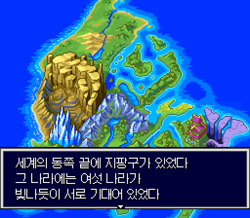

# 천외마경 제로 한글 패치 — 베타 1

슈퍼 패미컴용 「天外魔境ZERO」(Tengai Makyou Zero, 1995) 한국어 번역 패치입니다.
**베타판**입니다: 번역은 초벌 뒤 독립 검토를 거쳤지만 사람의 최종 검토가 끝나지 않았고, 처음부터 끝까지 실제로 플레이해 보지는 않았습니다. 어색한 문장이나 오역, 깨지는 화면이 남아 있을 수 있습니다.

비공식 팬 번역입니다. 이 패치에는 게임 롬이 들어 있지 않으며, 원본 게임은 직접 준비해야 합니다.

## 내려받기

[Releases](https://github.com/beck4679-alt/TengaiMakyouZero-KR/releases) 에서 `TengaiMakyouZero_KR_beta1.zip` (패치 + 이 설명 + 글꼴 라이선스)

## 필요한 원본 (일반판)

| 항목 | 값 |
|---|---|
| 판본 | Tengai Makyou Zero (Japan) (일반판, 게임 코드 AZRJ) |
| 크기 | 5,242,880바이트 (헤더 없음) |
| CRC32 | `1E327BD9` |
| SHA-1 | `91ff16da242d39736aead4d360bf6bf7c0afce82` |
| SHA-256 | `8620203da71d32d017bb21f542864c1d90705b87eb67815d06b43f09120318aa` |

「少年ジャンプの章」(점프판)에는 맞지 않습니다. 헤더(512바이트)가 붙은 `.smc` 파일(5,243,392바이트)은 앞 512바이트를 떼어 낸 뒤 적용하세요.

## 적용 방법

패치 파일 `TengaiMakyouZero_KR_beta1.xdelta` 의 형식은 xdelta(VCDIFF)입니다.

- 웹: [Rom Patcher JS](https://www.marcrobledo.com/RomPatcher.js/) 에서 원본 롬과 패치를 고르고 적용
- Windows: xdelta UI · Delta Patcher 에서 원본 롬과 패치를 고르고 적용
- 명령줄: `xdelta3 -d -s 원본.sfc TengaiMakyouZero_KR_beta1.xdelta 천외마경제로_한글.sfc`

적용 결과 (한글 대사를 넣으려고 롬을 8MB 로 늘렸습니다):

| 항목 | 값 |
|---|---|
| 크기 | 8,388,608바이트 (8MB) |
| CRC32 | `DB1E3AEB` |
| SHA-256 | `b9f96379f1e3de6da1868c0d93d100d41aaa8cb9bf6a763a1c7257086ae2c14d` |

원본이 다르면(헤더가 붙은 롬, 다른 판) 패치 안의 결과 체크섬이 맞지 않아 적용 도구가 멈춥니다.

패치 파일: 883,200바이트, SHA-256 `1b04fc4bfc3f1acf0fecf36f85f954af6c1e3949561d4fc4477f3d9e686aca36`

## 실행 환경

- SPC7110 칩(압축 해제·데이터 포트)과 실시간 시계를 에뮬레이션하는 에뮬레이터가 필요합니다
- 확인한 것: BizHawk 2.11.1 (BSNESv115+ 코어, Snes9x 코어). 다른 에뮬레이터와 실기는 확인하지 않았습니다
- 빈 세이브로 처음 켜면 게임에 들어 있는 점검 화면이 먼저 뜹니다: 「백업이 깨져 있습니다 / A 버튼을 누르세요」 → ALL OK → 「전원을 다시 켜 주세요」(리셋) → B 버튼 → ALL OK → 리셋. 그 뒤 시계와 생일을 입력하고 시작합니다

## 번역한 것

- 대사 전부(디버그용 개발자 문장 제외), 메뉴·이름표, 아이템·장비·술법·기술·적·지명 이름, 달력(사건·기념일), 시계·생일 입력 화면
- 이름 입력: 한글 조합 입력판 (완성형 2,350자, 책갈피 이름 — 애완동물 이름도 같은 입력판)
- 그림으로 된 글자: 첫 실행 점검 화면 문구, 전투 명령판(공격·방어·두루마리·오의·도구·후퇴), 작전 이름 판(한자 70자 → 한자음: 火炎 → 화염)
- 그대로 둔 것: 타이틀 로고, 맵 배경 그림 속 글자(족자·간판 등), 엔딩 스태프 롤(일본어 원문), 디버그용 개발자 문장(평소에는 볼 수 없음)

## 세이브

- 세이브 메모리 크기는 원본과 같습니다(8KB)
- 원본(일본어판)으로 만든 세이브는 가나로 지은 책갈피 이름이 깨져 보입니다(소지품의 「변경」으로 다시 지으면 됨). 그 밖의 호환은 충분히 확인하지 않았으니 새로 시작하기를 권합니다

## 오류 제보

오역·오타·어색한 문장·깨지는 화면을 발견하면 [Issues](https://github.com/beck4679-alt/TengaiMakyouZero-KR/issues) 에 남겨 주세요.
화면 캡처와 장소(마을·인물), 앞뒤 대사를 함께 적어 주시면 찾기 쉽습니다.

## 글꼴

한글 글꼴은 갈무리(Galmuri, © Lee Minseo)입니다 — 대사·메뉴는 갈무리11, 8×8 글자는 갈무리7, 굵은 판 글자는 갈무리11 을 두 번 찍어 그렸습니다.
SIL Open Font License 1.1 에 따라 쓰며, 라이선스 전문은 `LICENSE_Galmuri_OFL.txt` 에 있습니다.

## 변경 기록

- 베타 1 (2026-09-27): 첫 공개
